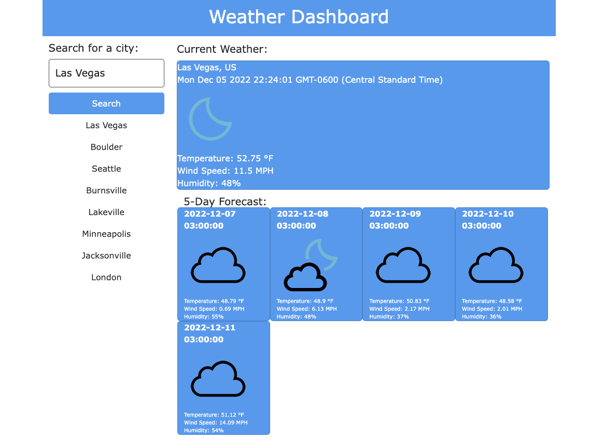

# Weather-Forecast

## Description

This project is a weather application that displays the current weather, and a 5 day forecast for any city that is typed into the search bar. By programming this website, I learned how to do fetch data from an API and display it onto a webpage.

## Table of Contents (Optional)

- [Link](#link)
- [Usage](#usage)
- [Credits](#credits)
- [License](#license)
- [Features](#features)

## Usage

To use this application, type a city into the search bar or click on a previously searched city listed underneath the search bar. Doing so will produce the current weather for that city as well as a 5 day forecast.

## Credits

https://openweathermap.org/api

https://www.w3schools.com/js/js_json_parse.asp

https://stackoverflow.com/questions/1531093/how-do-i-get-the-current-date-in-javascript

https://stackoverflow.com/questions/44177417/how-to-display-openweathermap-weather-icon

## License

See LICENSE in root folder of repository.

## Features

- Search bar for weather in any city
- API fetching
- Storage of previous searches within buttons which can be used to search
